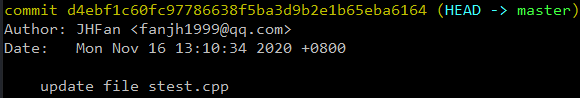

# 创建本地库 - git init
通常就直接把Git本地库的仓库根目录作为工程目录
#### 步骤总括
1. 新建文件夹 (这个文件夹就是工作区)
2. 在GitBash中进入该文件夹
3. 使用 `git init` 操作初始化仓库
#### git init操作
git init操作将一个目录初始化为git仓库 , 其会在该目录下创建.git目录 .  
***.git中包括如下内容 :***  
 

---

# 将文件提交至本地库 - git add / git commit
需要先提交到暂存区 , 再提交至本地库
#### 步骤总括
1. 在本地库(工作区)中新建文件
2. 使用 `git add 文件名` 操作将文件提交至暂存区
3. 使用 `git commit -m "注释" 文件名` 操作将暂存区的文件提交至本地库
    - -m : message , 允许为提交操作注释
    - 注释 : 对于这次提交动作的注释

>只有在本地库中 , 且通过add / commit命令操作过的文件Git才会对其进行管理 .

---

# 查看工作区与暂存区的状态 - git status
使用git status命令可以查看当前状态
#### 例子
  
***上述例子中*** :   
On branch master 表示主分支中
|状态|含义|
|-|-|
|Changes to be committed|在暂存区和工作区都存在的文件|
|Changes not staged for commit|被追踪但已被更新的文件|
|Untracked files|在工作区但没有被追踪的文件|
当暂存区里没有东西时 , 将显示 No commits yet 表示没有需要提交的东西
>提交至本地库的文件不会显示在Changes to be committed中  
>但本地库中的文件被修改也会出现在Changes not staged for commit中 , 也要重新add commit添加

---

# 查看提交日志 - git log
git log可以查看从最近开始知道最早一次的commit动作记录 
#### 例子
  
***上述例子中*** :   
commit : 后面的字符串是这个commit动作记录的索引  
Author : 执行该动作的人  
Date : 执行给动作的时间  
后面的字符串是执行commit动作时 -m 参数所携带的注释  
## 更多操作
#### 自动分页 - 空格 / B
当日志内容太多时 , 将自动分页显示.  
若最后一个日志项末尾显示 ***:*** 则表示还有下一页 , 若显示 ***(END)*** 则表示是最后一个日志项了 .   
使用 ***空格*** 向下翻页 , 使用 ***B*** 向上翻页 .  
#### 单行展示索引和注释 - git log --pretty=oneline
使用--pretty=oneline参数可以一行展示一个日志项 .  
这种方式只会展示每个日志项的索引和注释 .  
#### 单行展示部分索引和注释 - git log --oneline
使用--oneline参数可以一行展示一个日志项 .  
与--pretty=oneline不同的是它只展示索引的前7位 .  
#### 额外展示回退所需步数 - git reflog
使用git reflog操作可以在git log --oneline的基础上额外展示一个数字 ,   
这个数字表示回退到该步骤需要走几步 .  

---

# 查看文件的修改记录 - git blame
`git blame 文件名` 可以查看指定文件的历史修改记录

---

# 切换文件的版本 - git reset
使用 `git reset --hard 索引` 可以切换保存过的不同版本(同时清空未保存的工作区暂存区) . 
#### 例子
使用git reflog可以看到如下样式输出 :  
  
其中HEAD->master表示当前的版本 , 现在尝试切换到d4ebf1c版本 : 
  
可见版本被切换成功.
#### reset的3种模式:
- ***hard*** : 本地库 , 暂存区 , 工作区都切换版本 (两个版本的差异被删除 , 只保留切换到的的版本)
- ***mixed*** (缺省) : 本地库 , 暂存区切换版本 , 工作区不变 (回到add之后 , commit之前的状态)
- ***soft*** : 本地库切换版本 , 暂存区 , 工作区不变 (回到add之前的状态)
#### 选择版本:
可以直接使用日志项(版本)的索引 , 也可以使用如下方法 :   
***HEAD^*** : 上一个版本 , ***HEAD^^*** 上两个版本... ;  
***HEAD~1*** : 上一个版本 , ***HEAD~2*** 上两个版本... .  

---

# 删除文件 - rm , git add , git commit
删除一个文件 , 需要删除工作区 , 暂存区 , 本地库三处的对应文件 .
#### 步骤总括:
1. 删除工作区的文件 : `rm 文件名` 删除工作区的文件 ;
2. 将删除操作添加到暂存区 : `git add 文件名` (这个文件的最新操作是删除 , 将其添加到暂存区)
3. 将删除曹祖提交到本地库 : `git commit -m "注释" 文件名` (这个文件的最新操作是删除 , 将其提交到本地库)
>这里说将操作向上提交而不是将文件向上提交 .  
>意思是并不将这个文件的物理存储删掉 , 只是新版本中没有这个文件 .  
>日后回退版本也可以让这个文件重新出来 .
#### 找回被删除的文件
直接使用git reset切换到有这个文件的版本.

---

# 对比文件的差异 - git diff
## 对比工作区与暂存区中的文件差异
`git diff 文件名` 可以比对特定文件在工作区和暂存区的差异 .  
`git diff` 可以比对所有文件在工作区和暂存区的差异 .  
其中行首标注`-`且整行红色字体的是被删除的行 , 行首标注`+`且整行绿色字体的是被插入的行 .
#### 例子
在stest.cpp的行尾添加一行文字后 使用diff查看 :  
  
*这里原先尾行的1被删除后又添加 , 猜测是因为结束标识符处于尾行 , 因此添加新尾行也改动了旧尾行*
## 对比暂存区与本地库中的文件差异
`git diff 版本索引 文件名` 可以比对特定文件在暂存区和本地库中特定版本的差异 .  
`git diff 版本索引` 可以比对所有文件在暂存区和本地库中特定版本的差异 .  

---

# 分支操作 - git branch / git checkout
## 查看分支 - git branch -v
`git branch` 可以查看当前库中的所有分支 .  
`git branch -v` 可以查看所有分支及其当前的版本 .  
其中一个分支前会显示 `*` 这表示当前所在的分支 .  
## 创建分支 - git branch 分支名
`git branch 分支名` 可以创建一个指定名字的分支名 .  
>当创建一个新分支时 , Git将把当前所在分支的当前版本状态复制给新分支 .  
>即 , 创建分支的操作是从当前状态展开一个分支 .  
## 删除分支 - git branch -d 分支名
`git branch -d 分支名` 可以删除一个已经创建的分支 .  
>删除一个分支时 , 不能处于该分支下 .  删除操作不会删除该分支的衍生分支 .  
## 切换分支 - git checkout 分支名
`git branch 分支名` 可以切换到指定分支 .  
## 合并分支 -
在一个分支中 , 使用 `git merge 分支名` 可以将另一个分支的内容合并入该分支 .  
#### 分支冲突
合并分支时 , 若两个分支中同一个文件里的内容不一样 , 则产生分支冲突 . 此时会进入MERGING状态 .  
此时查看发生冲突的文件 (会提示) 可以查看两个分支中该文件的差异 .  

***解决方法*** : 
1. 直接在文件中修改 , 保留需要的部分 .
2. `git add` 将所有冲突的文件添加入缓存区
3. `git commit -m "备注"` 提交至本地库 (注意 : 这里的commit不能带文件名)

解决冲突之后 , 则合并完成 , 结束MERGING状态 .

>合并分支时以目标分支的内容为准 .   
>两个分支相同文件内的不同内容需要人为取舍 , 但两个分支之间的文件的不同则遵从目标分支 :  
>如B分支合并入A分支 , 则说明A中存在B中不存在的文件删除 , B中存在A中不存在的文件保留 .